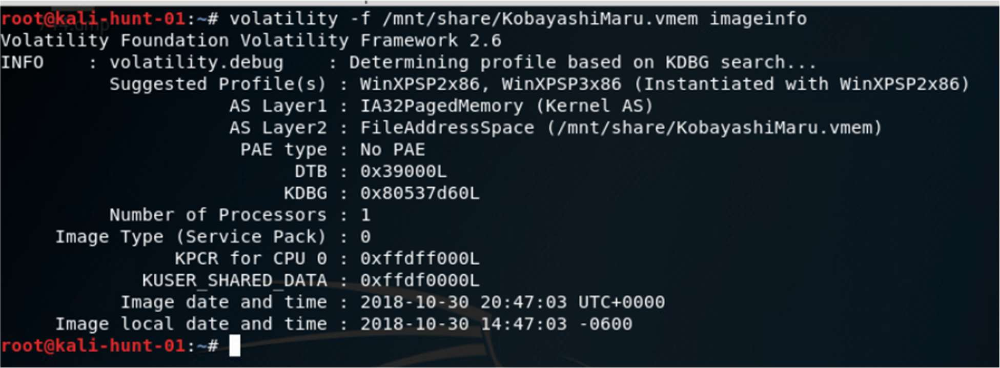
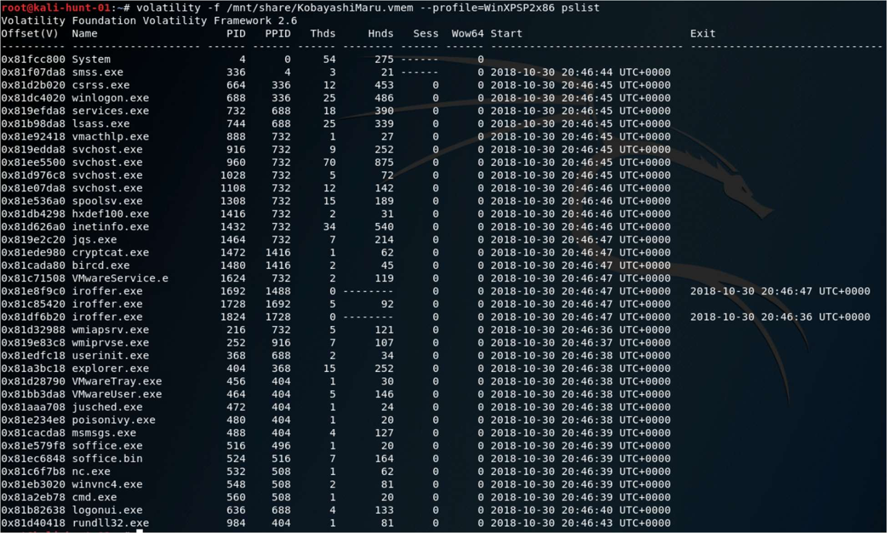
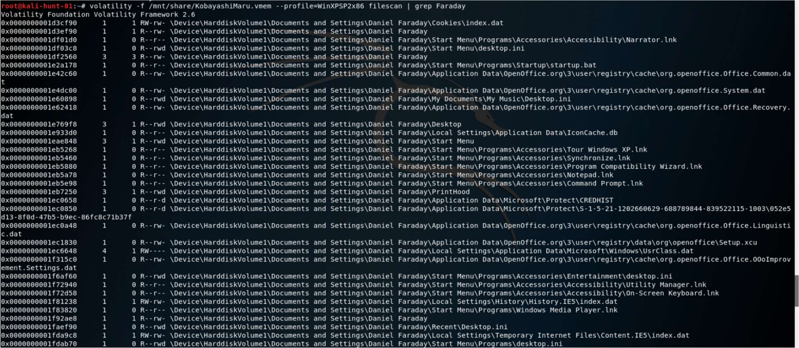
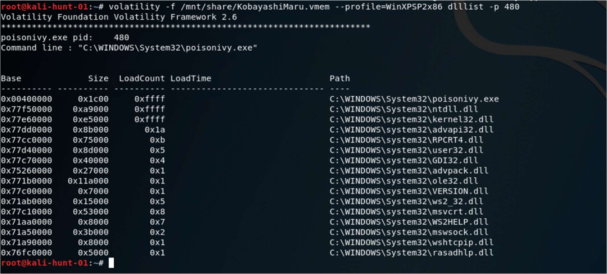
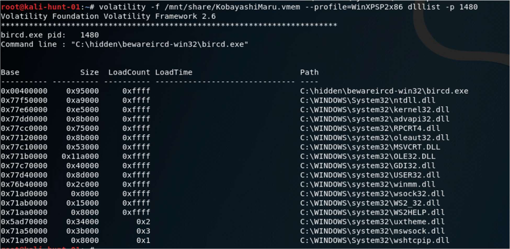
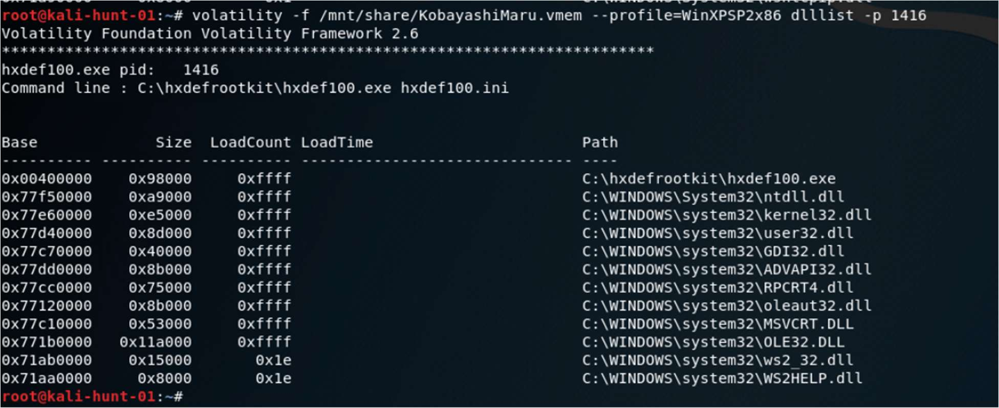
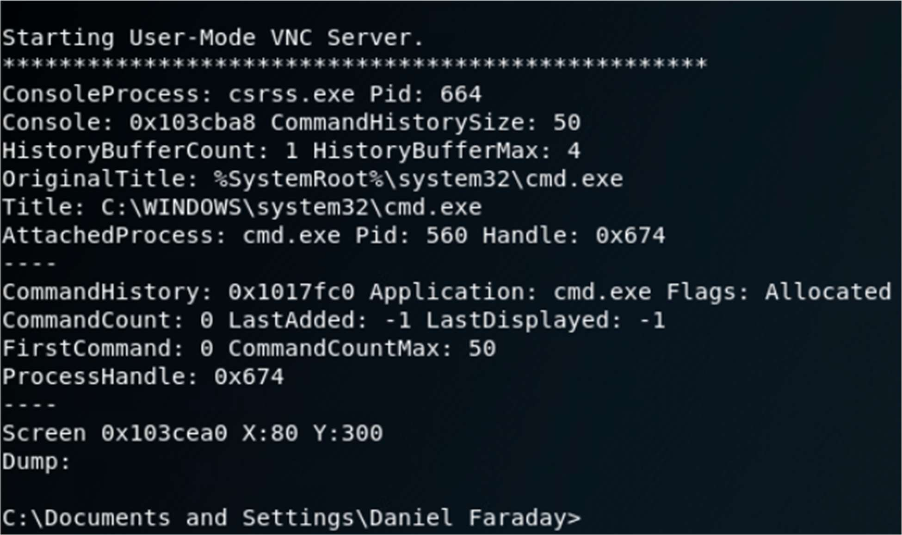

# Hunting in Memory – Lab Report

## Introduction

This report documents a memory forensics investigation of
`KobayashiMaru.vmem`, a memory snapshot from a Windows XP workstation.
Memory analysis enables investigators to examine volatile data left in RAM
to uncover running malware, backdoors and evidence of attacker activity.
The Volatility framework (version 2.6) was used to inspect the image,
identify the operating system profile, enumerate processes, inspect loaded
modules, search for files and recover console histories.

## Environment and Tools
 - **Memory image**: `KobayashiMaru.vmem`
- **Platform**: Windows XP Service Pack 2/3, 32‑bit, 512 MB of RAM【131694685109100†L37-L61】.
- **Tools**:
  - Volatility 2.6 with plugins (`imageinfo`, `pslist`, `psscan`,
    `dlllist`, `filescan`, `consoles`).
  - Supporting Linux utilities (e.g., grep) for filtering output.

## Procedure and Analysis

### OS identification

The first step was to determine the correct profile for the memory image.  Running
`volatility -f KobayashiMaru.vmem imageinfo` suggested the profile
`WinXPSP2x86` or `WinXPSP3x86` and reported a memory size of 512 MB【131694685109100†L37-L61】.
Figure 1 shows the output of this command.

### Process enumeration
`pslist` and `psscan` were used to list active processes.  In addition to standard
Windows services (e.g., `System`, `lsass.exe`, `svchost.exe`), several suspicious
executables were identified:

- **`poisonivy.exe`** – a remote‑access Trojan that grants attackers full control【131694685109100†L64-L100】.
- **`nc.exe`** – Netcat, commonly used for backdoors and file transfer【131694685109100†L64-L100】.
- **`bircd.exe`** – a Windows IRC server used to control bots【131694685109100†L64-L100】.
- **`iroffer.exe`** – an IRC file‑sharing bot【131694685109100†L64-L100】.
- **`cryptcat.exe`** – an encrypted Netcat variant for covert C2【131694685109100†L64-L100】.
- **`cmd.exe`** and **`rundll32.exe`** – command shells likely launched by malware.

Figure 2 illustrates the process list with these suspicious programs highlighted.

### File and registry artifacts
`filescan` located numerous file handles associated with the **Daniel Faraday**
user profile.  Many of the files were lnk shortcuts or cached objects in
`Documents and Settings\\Daniel Faraday`, supporting the conclusion that
Faraday was the active user.  The `hivelist` plugin failed to locate
registry hives, so password hashes could not be recovered.  Figure 3 shows a
snippet of the file scan output filtered for “Faraday”.

### DLL and module analysis
For each suspicious process, we examined loaded DLLs using `dlllist`.  The
malware processes loaded a standard set of Windows DLLs along with modules
necessary for networking and persistence.  For example, the `poisonivy.exe`
process loaded `ws2_32.dll` and `mswsock.dll` to enable socket communication
(Figure 4); `bircd.exe` loaded IRC‑related modules (Figure 5) and
`cryptcat.exe` loaded crypto libraries.  Some modules (such as `hxdef100.exe`
shown in Figure 6) belonged to a rootkit toolkit.

### Console sessions and user activity
The `consoles` plugin retrieved the command history and screen buffers of
interactive sessions.  It reported a console attached to `cmd.exe` launched
within `csrss.exe` (PID 664), with the title `C:\\WINDOWS\\system32\\cmd.exe`
and command prompt at `C:\\Documents and Settings\\Daniel Faraday>` (Figure 7).
This confirmed that an interactive shell was used under the Faraday account.

## Indicators of Compromise

From the analysis we extracted the following indicators:

- Malicious executables: `poisonivy.exe`, `nc.exe`, `bircd.exe`, `iroffer.exe`,
  `cryptcat.exe`, `hxdef100.exe`, `cmd.exe`, `rundll32.exe`.
- Presence of an IRC server (`bircd.exe`/`iroffer.exe`) and encrypted backdoor
  (`cryptcat.exe`) suggests membership in a botnet controlled via IRC.
- Volatility `consoles` output shows commands executed as **Daniel Faraday**,
  indicating attacker activity under this user account【131694685109100†L106-L129】.

## Conclusion

The memory image analysis reveals that the Windows XP system was heavily
compromised.  Multiple backdoors (Poison Ivy RAT, Netcat and Cryptcat), an
IRC server and rootkit components were running concurrently, providing the
attacker with persistent remote access and C2 channels.  The compromised
host was likely part of a larger IRC‑based botnet.  Incident responders
should isolate the host, collect additional forensic data, eradicate the
malware and reset all affected credentials.

## References

- Volatility Foundation – <https://www.volatilityfoundation.org/>
- Course notes and lab instructions (see accompanying PDF)【131694685109100†L37-L61】.
